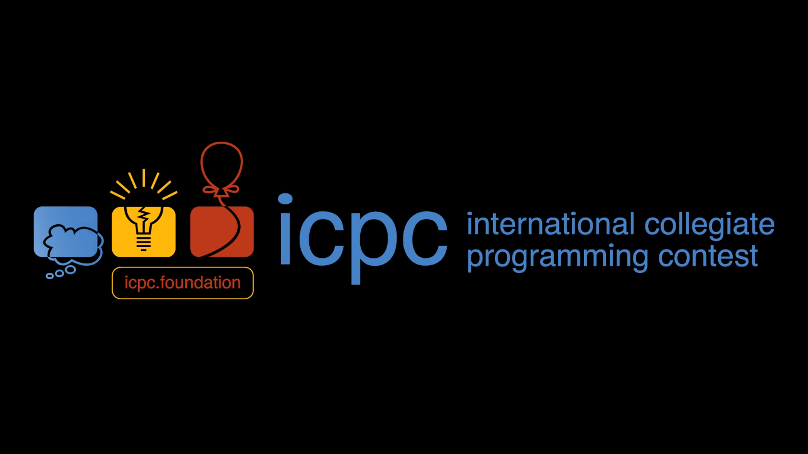
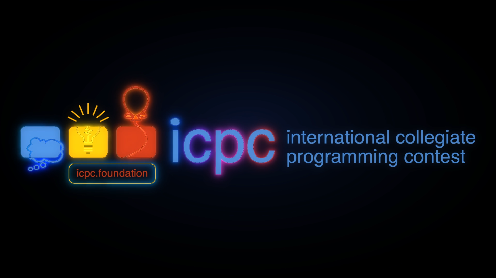

# dsh-icpc-boot

[English](README.en.md) | [中文](README.md)

**A full-screen ICPC ident intro for the [DeepSeek Harness](https://github.com/deepseek-ai) (DSH) web client.**
It plays on every client start and steps aside when it finishes; click the screen or press `Esc` to skip at any
time; Settings → General switches to the neon cut or turns it off entirely.





## Features

- 🎬 **Two cuts**: a 5-second intro and a 6-second neon cut, switchable or disposable
- ⏭️ **Skippable**: click anywhere or press `Esc`
- 🧱 **Covers DSH's own boot card**: the host half injects the opening frame while the document is still
  parsing, so `HARNESS / Loading plugins…` never shows
- 🎞️ **Untouched footage**: both mp4 files are served byte-for-byte — no transcode, no frame extraction —
  with real `Range` support
- 📦 **Zero dependencies, no build step**: `lib/*.js` *is* the shipped artifact

## The two cuts

| Mode | Asset | Length | What it looks like |
| --- | --- | --- | --- |
| Intro `intro` | `assets/icpc-intro.mp4` | 5.0 s | black → a single spark → the ICPC geometry (blue/yellow/red) dropping block by block → the ICPC wordmark rising out of a blur → caption fade-in → a diagonal light sweep → glow hold |
| Neon `neon` | `assets/icpc-neon.mp4` | 6.0 s | vignette → the outline drawn stroke by stroke in neon → a pulse → the solid logo revealed pixel by pixel by coverage → glow hold |
| Off `off` | — | — | no cover is injected and no video is mounted |

Both cuts have a **completely black frame 0** (measured: `0.0000` of pixels are non-near-black), which is what
makes the cover → video handoff invisible.

## Install

The plugin is an ordinary DSH profile bundle: a `package.json` (declaring `dsh.bundle.patch`), a
`cordis.patch.yml` (inserting into the bundle layer) and two halves (`lib/index.js` on the host,
`lib/client.js` in the browser).

**Restart DSH** after installing — the bundle layer is only assembled at startup, a page refresh is not enough.

### An ordinary profile (`web`, …)

```sh
dsh plugin --profile web add /path/to/dsh-icpc-boot
```

Or edit the profile's `package.json` by hand (which is what the CLI does):

```jsonc
{
  "dependencies": { "dsh-icpc-boot": "link:/path/to/dsh-icpc-boot" },
  "dsh": { "profile": { "bundles": ["@deepseek-ai/dsh-base", "@deepseek-ai/dsh-web-app", "dsh-icpc-boot"] } }
}
```

`link:` becomes a junction on Windows and a symlink elsewhere. Once published to npm,
`dsh plugin --profile web add dsh-icpc-boot` works as well.

### The `desktop` profile (the Electron app)

`dsh plugin --profile desktop …` is refused by a guard (that profile is managed exclusively by the Electron
app), so its project has to be edited by hand. Full steps, why `pnpm install` is deliberately skipped, and how
to verify the wiring without starting the app: **[docs/DESKTOP-PROFILE.md](docs/DESKTOP-PROFILE.md)**.

### ⚠️ Fighting another boot splash over the screen

Any plugin that also covers the first frame (for example
[dsh-550c-boot](https://github.com/yannicksong0106/dsh-550c-boot)) competes with this one. Enable only one:
drop the other from `dsh.profile.bundles`, or add `disabled: true` for it in the profile's `cordis.patch.yml`.

## Usage

Settings → **General** → "ICPC 开屏动画" (ICPC boot splash): pick **intro / neon / off**, and the **Preview**
button on the right replays the current cut immediately.

The preference lives in `localStorage` under `dsh-icpc-boot:mode`; in `off` the plugin never touches the DOM.

Console entry points:

```js
__dshIcpcBoot.readMode()      // current preference
__dshIcpcBoot.writeMode('neon')
__dshIcpcPreview('intro')     // replay now, returns a stop function
__dshIcpcBoot.stop()          // leave the screen now
```

## How it works

Two halves, each owning a different stage of the first frame — that is this plugin's central design constraint:

- **The host half** (`lib/index.js`) injects one stylesheet and one **synchronous** script ahead of the shell,
  painting a full-screen cover in the video's own first-frame colour via `html.dshicpc-first::before`
  (`z-index: 2147483000`) so DSH's boot card is covered. Measured: the boot card appears at **67 ms** and the
  plugin bundle only runs at **338 ms**, so this layer *has* to come from `webserver/index-inject` — client
  code is too late.
- **The client half** (`lib/client.js`) mounts the video during **module evaluation** (before cordis calls
  `apply`), and the moment the video enters the DOM it retires the cover (`__dshIcpcFirstFrame.end()`);
  `apply` is left with the settings row and disposal.
- The videos are served by three `exact` routes registered by the host half, with `Range` genuinely
  implemented (so the browser can stream and seek):

  | Route | Content |
  | --- | --- |
  | `GET /dsh-icpc-boot/meta.json` | version, mode list, default, localStorage key, clip list |
  | `GET /dsh-icpc-boot/assets/icpc-intro.mp4` | intro cut (294 341 B) |
  | `GET /dsh-icpc-boot/assets/icpc-neon.mp4` | neon cut (448 674 B) |

  An unsatisfiable `Range` returns `416` + `content-range: bytes */<total>`, a method other than `GET/HEAD`
  returns `405`, and `HEAD` keeps `content-length` without a body.
- **Watchdogs**: once metadata arrives the cover retires at `duration + 2.5 s`, and at 9 s if metadata never
  arrives; `error`, a rejected `autoplay` and `ended` all retire it too — **the cover can never be left on
  screen**.

## Repository layout

```
lib/index.js      host half: first-frame cover + routes (ESM)
lib/client.js     client half: mount / retire / settings row (__ModuleLoader__ bundle)
cordis.patch.yml  bundle layer: insert id=icpc-boot → name=dsh-icpc-boot
assets/*.mp4      the two cuts, untouched
docs/             previews, architecture, verification, desktop-profile notes
scripts/verify.mjs  synthetic suite (100 assertions)
scripts/e2e.mjs     real-app suite (39 assertions), builds a throwaway profile
```

## Tests

Two independent suites, **139 assertions** in total:

```sh
npm run check     # syntax check for both halves
npm run verify    # 100: synthetic environment (stub loader + real Chrome + real mp4)
npm test          # check + verify; needs no DSH install — this is what CI runs
npm run e2e       # 39: the real DSH web app, zero stubs
npm run test:all  # all 139
```

The browser stages need `puppeteer-core`: it is resolved from this package's `node_modules` first, then from an
installed DSH profile (default `~/.dsh/profiles/desktop`, override with `DSH_PROFILE_MODULES`). Chrome comes
from `CHROME_PATH` or from the usual install locations.

### 1. The synthetic suite — `scripts/verify.mjs` (100)

Assertions run against **the real artifacts**, in two stages:

1. **Host half** — a stub `ctx` collects the injected rows and routes, then a real HTTP server exercises the
   assets: full / `HEAD` / closed, open and suffix ranges / unsatisfiable range / bad method, comparing bytes
   against the files on disk.
2. **Browser** — real Chrome loads the injected rows + real `lib/client.js` + real mp4s: the cover is asserted to
   be in place before any client code runs, the video really decodes and advances, the cover is retired, both
   `Esc` and click skip, `off` has neither cover nor video, the neon preference survives a reload, and **a 404
   asset still retires the cover without leaving leftovers**.

Stage 2 also **seeks to exact timestamps** and samples pixels, proving that what is on screen is the ICPC
animation itself rather than a black rectangle or a stuck frame (this development machine has no usable vision
model, so verification does not rely on *looking* at screenshots):

| Sample | `lit` (non-near-black pixels) | `saturated` (coloured pixels) | Conclusion |
| --- | --- | --- | --- |
| intro `t=0` | 0.0000 | 0.0000 | frame 0 is black → the handoff is invisible |
| intro `t=3.6` | 0.0605 | 0.0476 | already a coloured line drawing (79% of lit pixels are coloured) |
| neon `t=5.4` | 0.1769 | 0.0904 | brighter than the intro (mean luminance 13.6 vs 8.4) |

A run writes three screenshots into `docs/` (the ones at the top of this page, plus
[`docs/preview-first-frame.png`](docs/preview-first-frame.png) recording the black frame 0).

### 2. The real-app suite — `scripts/e2e.mjs` (39)

However thorough the synthetic suite is, it cannot prove four things: that DSH really discovers this bundle,
really applies `cordis.patch.yml`, really publishes those three routes on its own web server, and really
evaluates the client half with its own `__ModuleLoader__`. `scripts/e2e.mjs` answers those four with **a real
DSH**.

It first builds a throwaway `DSH_HOME` in a temp directory containing a single profile whose bundle list is
`@deepseek-ai/dsh-base` + `@deepseek-ai/dsh-web-app` + `dsh-icpc-boot`; junctions borrow the installed package
tree and link this package in — **no install, no network**. Then it starts `dsh <profile> --port 0 --no-open`,
scrapes the tokened URL out of the startup line, connects a real Chrome to it, and finally reaps the process
and deletes the temp home. **The profile, storage and session you are using are never touched**, so this can be
re-run at any time.

```sh
npm run e2e
DSH_E2E_URL=http://127.0.0.1:19387/?token=… node scripts/e2e.mjs   # attach to a running instance
ICPC_E2E_KEEP=1 npm run e2e                                        # keep the temp home for debugging
```

Measured `39/39 end-to-end checks passed`, with sampling numbers **bit-identical** to the synthetic suite and
zero page errors or console errors. The most convincing single result: the cover is retired by the client half
about **200–250 ms after navigation** — far ahead of the 7.5 s watchdog — which means the handoff is done by
product logic, not by a timeout happening to fire.

## Known limits

- The cover background is **solid black / a radial gradient**, not a screenshot of the video's first frame
  (frame extraction needs ffmpeg, which this project does not depend on). Both cuts happen to start on black,
  so there is no visible difference; footage whose first frame is not black would need another approach.
- The desktop title-bar colour tokens (`--dsw-specific-sidebar-fill`, …) are not set, so on Windows the OS
  title bar is a different colour for the first instant of the splash.
- `scripts/e2e.mjs` runs against a throwaway isolated profile, not against a real profile with third-party
  plugins installed.

## License

MIT, see [LICENSE](LICENSE). The ICPC name and logo are trademarks of the ICPC Foundation and its rightsholders;
this plugin is a demonstration and is not affiliated with ICPC.

Architecture credit and asset provenance: [CREDITS.md](CREDITS.md).
